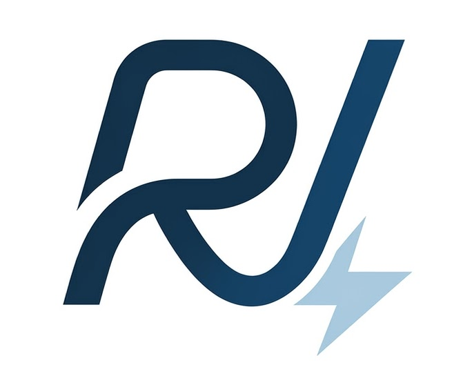
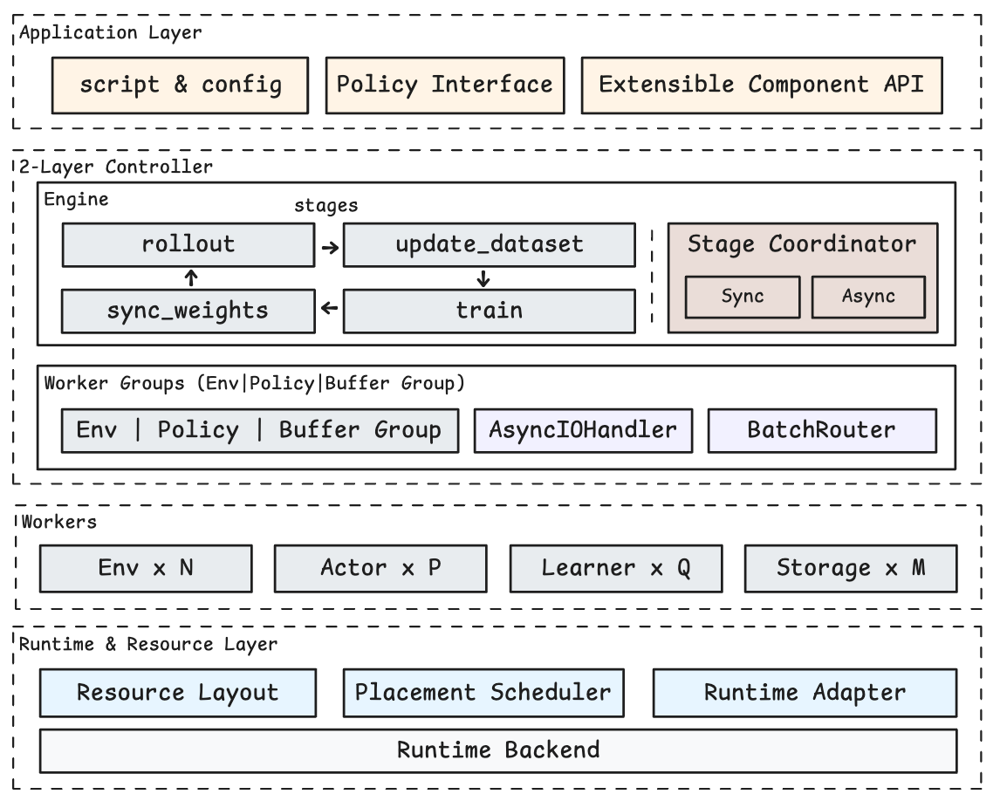
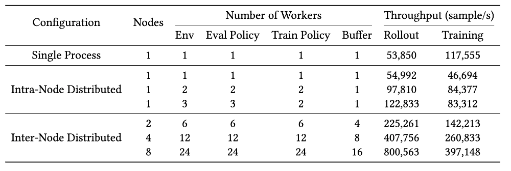
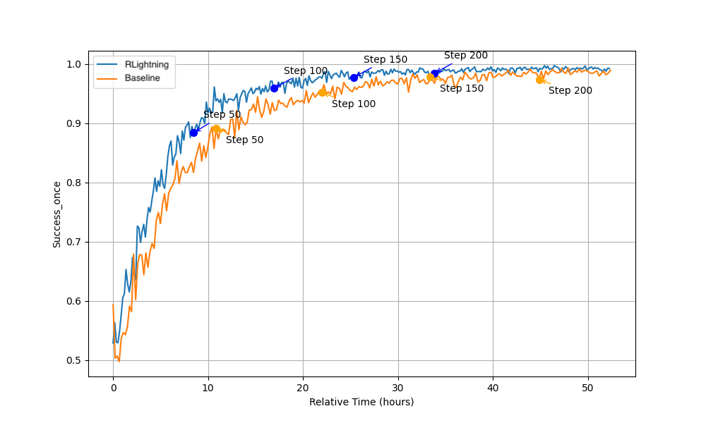

<h1 align="left">
  
  RLightning
</h1>

<p align="center"><strong>A Flexible Reinforcement Learning Framework that Unifies Prototyping and Scaling for Embodied Intelligence</strong></p>

<p align="center">
  
</p>
<!-- Replace the placeholder URLs below with your actual project links. -->
<p align="center">
  <a href="https://rlightning.readthedocs.io/en/latest/">
    
  </a>
  <a href="https://arxiv.org/abs/your-paper-id">
    
  </a>
</p>


## What is RLightning?

RLightning is a reinforcement learning framework designed for embodied intelligence — from humanoid locomotion to robotic manipulation. Its core principle is "prototype locally, scale seamlessly": researchers develop and debug algorithms in a standard single-process workflow, then scale to distributed multi-node, multi-GPU training by changing only a config file, with zero code modifications. 

## Core Design

**Unified Programming Interface** — A transparent runtime adaptation layer unifies the programming interface across single-process and distributed execution, enabling zero-code migration from local prototype to multi-node cluster.

**Decoupled Control and Data Planes** — Researchers orchestrate coarse-grained workflows through the control engine, while the underlying data plane handles inter-node data transfer and task scheduling via asynchronous I/O and pipelining, maximizing throughput without exposing distributed complexity.

**Fine-Grained Resource Management** — Independent scaling of compute modules with flexible co-location and scheduling strategies. GPU-level process co-location minimizes communication overhead for high-frequency interactions, while dynamic on/offloading enables compute reuse for sequential components.

**Modular Heterogeneous Ecosystem Integration** — Loosely coupled modular design enables standardized integration of mainstream simulators (IsaacLab, MuJoCo, ManiSkill), real robot hardware, and classic algorithm libraries (RSL-RL) through extensible interfaces.


<p align="center">
  
</p>


## Performance Highlights

**Up to 15x throughput scaling** - Humanoid whole-body control training scales from single GPU to 64 GPUs (8 nodes) with configuration changes only, achieving up to 15x data throughput improvement. Asynchronous I/O and pipeline optimizations deliver 3.75x additional throughput gain at 8-node scale.
<p align="center">
  
</p>

**30%+ throughput improvement on VLA tasks** — On compute-intensive OpenVLA RL tasks, RLightning improves training throughput by over 30% compared to baselines while maintaining identical convergence curves with no loss in accuracy.
<p align="center">
  
</p>


## Supported Features

| Category | Component | Description |
|----------|-----------|-------------|
| **RL Components** | DataBuffer | `RolloutBuffer` (on-policy), `ReplayBuffer` (off-policy) |
| | Policy | Interface for policy models and training/inference algorithms |
| | Env | ManiSkill, MuJoCo, IsaacLab, Libero, Remote Env |
| **Multi-dimensional Scaling** | Env | Vector env count, env instances, heterogeneous simulators |
| | Task | Multiple tasks within a single training run |
| | Eval Policy (Actor) | Multiple eval workers with stateful and load-balancing routing |
| | Train Policy (Learner) | Single-process or DDP distributed training |
| | Buffer | Unified or sharded storage with global sampling and data routing |
| **Task Scheduling** | Synchronous | `SyncRLEngine` for on-policy algorithms (e.g. PPO) |
| | Asynchronous | `AsyncRLEngine` for off-policy algorithms |
| **Execution Mode** | Single-process | Prototype and debug algorithms locally |
| | Distributed | Multi-process, multi-GPU, multi-node with data-parallel training |
| **Resource Scheduling** | Default / Disaggregate / Colocate / Manual | Flexible resource pool strategies |
| **Weight Sync** | Double buffer / CPU buffer / Sharded | Multiple strategies for different memory/throughput tradeoffs |
| **Observability** | Logging & Profiling | TensorBoard, Wandb, SwanLab; built-in timing profiler |


## Built-in Examples

| Algorithm | Simulator | Engine | Example |
|-----------|-----------|--------|---------|
| OpenVLA PPO | ManiSkill | `syncrl` | `examples/openvla_ppo/` |
| OpenPI PPO | Libero | `syncrl` | `examples/openpi_ppo/` |
| WBC Tracking | IsaacLab | `rsl` / `async_rsl` | `examples/wbc_tracking/` |

## Build Your Own Algorithm

Start from the template and implement your custom policy:

```bash
cp -r examples/algorithm_template/ /path/to/your/project
cd /path/to/your/project && uv sync
```

A minimal `train.py` like:

```python
from pathlib import Path
from rlightning.utils.config import MainConfig
from rlightning.utils.launch import launch
from rlightning.utils.builders import (
    build_env_group, build_policy_group, build_data_buffer, build_engine
)

def main(config: MainConfig):
    env_group = build_env_group(config.env)
    policy_group = build_policy_group(config.policy.type, config.policy, config.cluster)
    buffer = build_data_buffer(config.buffer.type, config.buffer)
    engine = build_engine(config, env_group, policy_group, buffer)
    engine.run()

if __name__ == "__main__":
    launch(main_func=main, config_path=Path(__file__).parent / "conf")
```

Subclass `BasePolicy`, implement `rollout()` and `learn()`, register with `@POLICY.register("my_algo")`, and launch with `bash launch_train.sh`.

## Documentation

Hosted documentation: [https://rlightning.readthedocs.io/en/latest/](https://rlightning.readthedocs.io/en/latest/)

Full documentation source is available under [`docs/source/`](docs/source/), covering:

- [Installation](docs/source/getting_started/installation.rst)
- [Quickstart](docs/source/getting_started/quickstart.rst)
- [System Architecture](docs/source/user_guide/system_architecture.rst)
- [Configuration](docs/source/user_guide/configuration.rst)
- [Algorithms Overview](docs/source/algorithms/overview.rst)
- [Build Your Own RL Project](docs/source/getting_started/build_your_own_rl.rst)
- [Debug and Scale Up](docs/source/user_guide/debug_scaling_up.rst)
- [Contributing Guide](docs/source/contribution/contributing_guide.rst)

## Contributing

See the [Contributing Guide](docs/source/contribution/contributing_guide.rst) for development setup and code review guidelines.

## License

This project is licensed under the Apache License 2.0. See the [LICENSE](LICENSE) file for details.
Third-party code and copied/adapted files are documented in [THIRD_PARTY_NOTICES.md](THIRD_PARTY_NOTICES.md).
